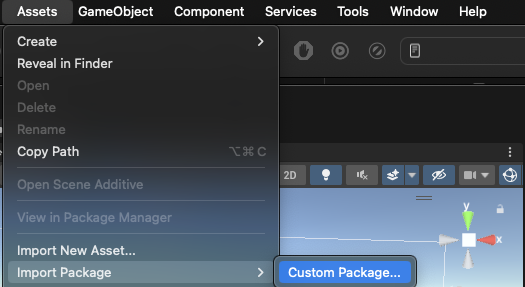
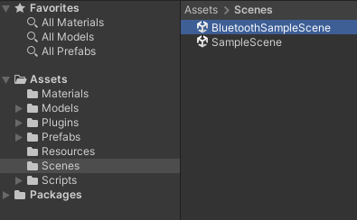
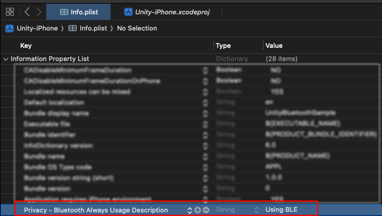
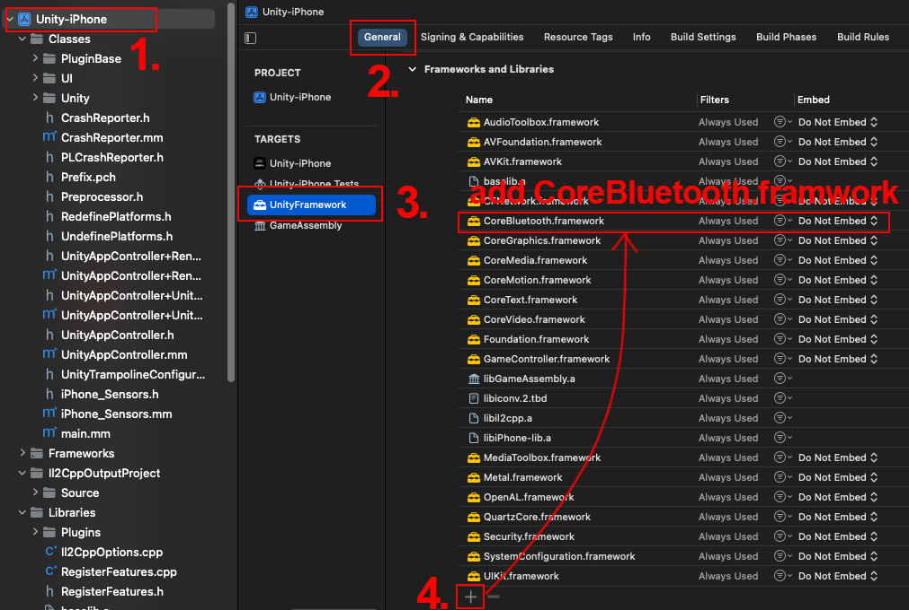

# UnityBluetoothPlugin.github
include android and iOS

[Download Link](https://github.com/Space-Capsule/UnityBluetoothPlugin.github/blob/main/UnityBluetoothPlugin.unitypackage)

How to use
1) create new Unity Project
2) in Build Settings, change target to Andoid or iOS
3) in top tab, select Assets -> Impost Package -> Custom Package.. -> select UnityBluetoothPlugin.unitypackage to import

   
4) in Scene foloder, select BluetoothSampleScene

that is a sample, just build apk or Xcode Project, 
for example, 
build to as android app, 
then click "Scan" button (the device name must contain "HC-" or "SC-BLE" or "SC-LTC")
if device found, you will see the button on list
then select device you want to connect.

## For iOS with Xcode

1. Set Bluetooth runtime permission, in ``Info.plist`` file,
   (1) add "Privacy - Bluetooth Always Usage Description" for Key.
   (2) and Type "Using BLE" or anythigns you want for Value.

2. Add CoreBluetooth.framework

